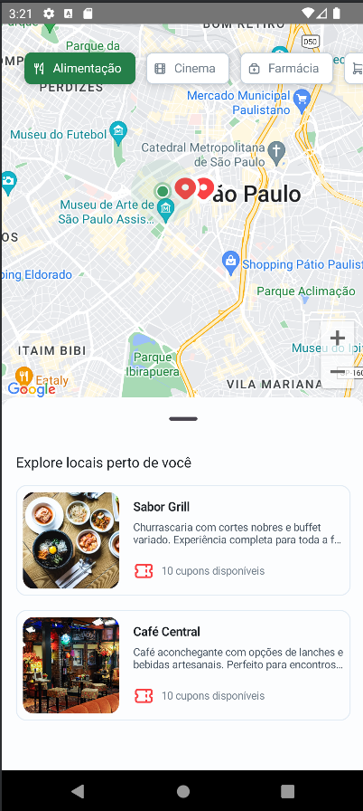
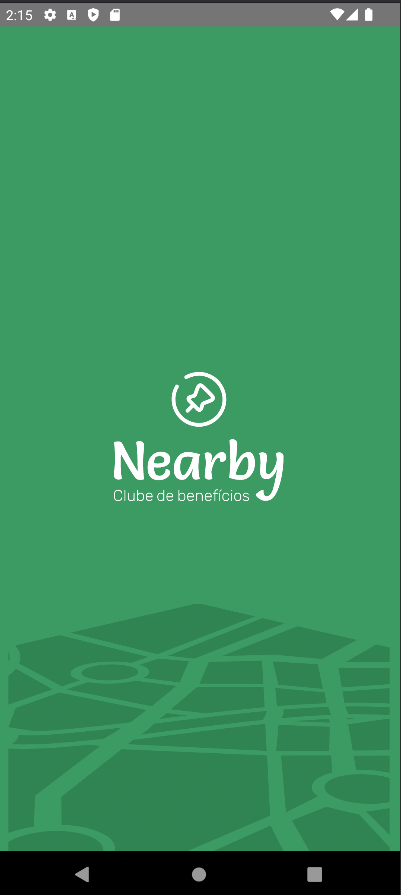

# Nearby - Clube de Benefícios

## Sobre o Projeto

Nearby é um clube de benefícios que permite aos usuários encontrar estabelecimentos próximos e ativar cupons de descontos. Nosso objetivo é facilitar a descoberta de locais e garantir vantagens exclusivas para nossos membros.

## Funcionalidades

- **Encontre estabelecimentos perto de você**: Veja locais próximos da sua localização atual.
- **Ative cupons com QR Code**: Escaneie o código no estabelecimento para ganhar benefícios.
- **Garanta vantagens**: Ative cupons de qualquer lugar, em vários tipos de estabelecimentos.

## Tecnologias e Ferramentas Utilizadas

- **Google Maps API**: Integração com a API do Google Maps para mostrar estabelecimentos próximos.
- **Jetpack Compose**: Utilizado para criar a interface de usuário declarativa e reativa.
- **Kotlin Coroutines**: Para gerenciar operações assíncronas de maneira eficiente.
- **Arquitetura MVVM**: Implementação da arquitetura Model-View-ViewModel para uma melhor separação de responsabilidades.
- **Dagger Hilt**: Para injeção de dependências, facilitando a criação de componentes reutilizáveis.
- **Retrofit**: Para realizar chamadas HTTP e consumir APIs RESTful.

## Screenshots

Aqui estão algumas capturas de tela do aplicativo:

<p align="center">
  
  
</p>

## Como Executar

Para executar o projeto, siga os passos abaixo:

1. **Clone o repositório**:
   ```bash
   git clone https://github.com/seu-usuario/nearby.git

  Abra o projeto no Android Studio.

  Compile e execute o aplicativo no dispositivo ou emulador de sua escolha.

## Contribuições

Contribuições são bem-vindas! Sinta-se à vontade para abrir issues e pull requests. Por favor, siga o guia de contribuição.
## Licença

Este projeto está licenciado sob a licença MIT. Veja o arquivo 
